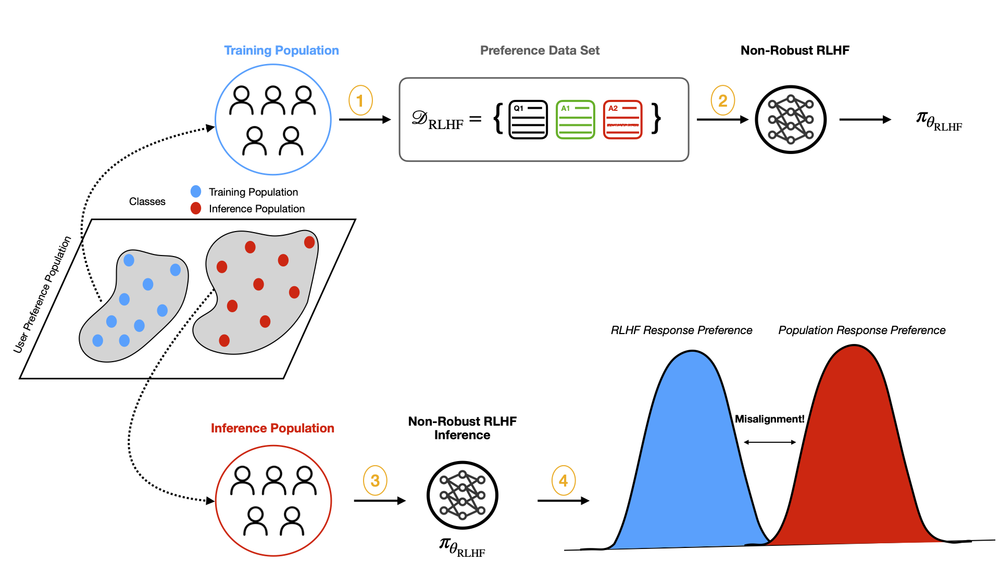
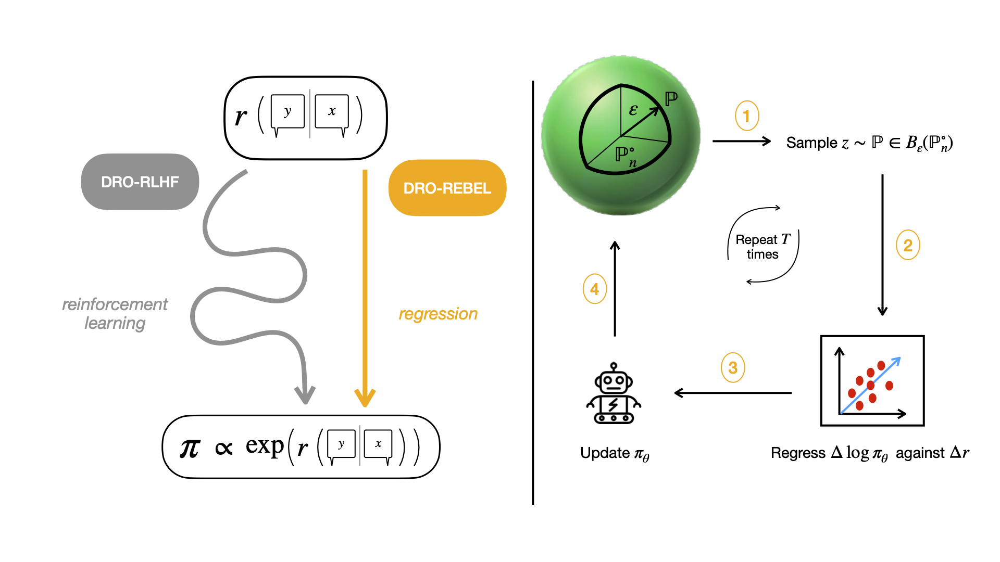

# DRO–REBEL: Distributionally Robust Relative-Reward Regression for Fast and Efficient LLM Alignment



Standard RLHF algorithms like DPO and PPO fit a single reward model and depend on heuristic tricks (e.g., clipping, value baselines), while recent DRO variants such as WDPO and KLDPO improve robustness but still involve complex updates.  In contrast, DRO–REBEL embeds Wasserstein, KL and $\chi^{2}$ uncertainty directly into REBEL’s simple regression‐based update—eliminating extra heuristics—and consistently outperforms DPO, PPO, WDPO and KLDPO in robustness to preference shifts and empirical sample efficiency.



---

## Contents

* [Overview](#overview)
* [Environment Setup](#environment-setup)
    * [Quick Start (setup.sh)](#quick-start-setupsh)
    * [Manual Installation](#manual-installation)
* [Repo Layout](#repo-layout)
* [Data](#data)
* [Core Training Pipelines](#core-training-pipelines)
  * [1) Emotion Alignment (SFT → Reward → REBEL/DPO variants)](#1-emotion-alignment-sft--reward--rebeldpo-variants)
  * [2) ArmoRM Multi-Objective Alignment (online scoring)](#2-armorm-multiobjective-alignment-online-scoring)
  * [Optional: Precompute ArmoRM Scores Distributed](#optional-precompute-armorm-scores-distributed)
* [DeepSpeed & Distributed](#deepspeed--distributed)
* [SLURM](#slurm)
* [Configuration & Hyperparameters](#configuration--hyperparameters)
* [Troubleshooting](#troubleshooting)
* [Citation](#citation)
* [Acknowledgments](#acknowledgments)

---

## Overview

This repo provides:

* **REBEL and DRO–REBEL variants**: REBEL, W-REBEL (Wasserstein), KL-REBEL, χ²-REBEL, plus DPO/WDPO/KL-DPO baselines.
* **DeepSpeed ZeRO-2** integration for robust multi-GPU training.
* **Two alignment settings**:

  1. **Emotion Alignment** on the HF *emotion* dataset with a learned reward model.
  2. **ArmoRM Multi-Objective Alignment** using RLHFlow’s **ArmoRM-Llama3-8B-v0.1** to derive 19 per-objective rewards + MoE score and create preferences on the fly.

Both pipelines share a simple, modular optimizer interface and identical training hyperparameters for clean comparisons.

---

## Environment Setup

We recommend a fresh Conda env named `dro-rebel`.

### Quick Start (`scripts/setup.sh`)

One-shot bootstrap that creates the env, installs PyTorch (CUDA or CPU wheels), core deps, optional extras, and writes a default DeepSpeed ZeRO-2 config.

```bash
# default: auto-detect GPU (uses cu121 wheels if found), creates env "dro-rebel"
bash scripts/setup.sh

# force CPU wheels
TORCH_CHANNEL=cpu bash scripts/setup.sh

# force CUDA 12.4 wheels + optional extras
TORCH_CHANNEL=cu124 INSTALL_FLASH_ATTN=1 INSTALL_BITSANDBYTES=1 bash scripts/setup.sh

# custom conda path/env name
CONDA_SH=~/miniconda3/etc/profile.d/conda.sh CONDA_ENV=dro-rebel bash scripts/setup.sh
```

What the script installs:

* `torch`, `torchvision`, `torchaudio` (`cu121|cu124|cpu` wheels)
* `transformers`, `datasets`, `accelerate`, `deepspeed`, `sentencepiece`, `numpy`, `pandas`, `scikit-learn`, `tqdm`, `pyarrow`
* Optional: `flash-attn` (if `INSTALL_FLASH_ATTN=1`), `bitsandbytes` (if `INSTALL_BITSANDBYTES=1`)
* Writes `configs/ds_zero2.json` if missing

**Then authenticate with Hugging Face (for gated models):**

```bash
huggingface-cli login
```

---

### Manual Installation

```bash
# Create env
conda create -y -n dro-rebel python=3.10
conda activate dro-rebel

# CUDA build of PyTorch (choose versions per your system)
pip install --upgrade pip
pip install torch torchvision torchaudio --index-url https://download.pytorch.org/whl/cu121

# Core deps
pip install transformers datasets accelerate deepspeed tqdm numpy pandas scikit-learn

# Optional (FlashAttention2, if your stack supports it)
# pip install flash-attn --no-build-isolation

# Authenticate with Hugging Face (needed for some models)
huggingface-cli login
```

**GPU guidance.** Experiments were run on 8×H100 (bf16). ZeRO-2 works well on A100/RTX as well.

---

## Repo Layout

```
.
├── ds_zero2.json # DeepSpeed ZeRO-2 config
├── run_sft.sh                   # SFT trainer (torchrun if multi-GPU)
├── run_reward.sh                # Reward model trainer (torchrun if multi-GPU)
├── run_rebel_local.sh           # Emotion REBEL/DPO with DeepSpeed
├── run_all_local.sh             # SFT + Reward + REBEL end-to-end
├──slurm_rebel_ds.sh            # SLURM launcher (single-node, DS)
├── experiments/
│   ├── run_emotion_rebel.py         # Emotion: runner for REBEL/DPO variants
│   └── run_armorm_alignment.py      # ArmoRM: online multi-objective alignment
├── src 
│   ├── models/
│   │   ├── gpt2_models.py               # SFT & reward model loaders
│   │   ├── rebel_optimizers.py          # REBEL, W-REBEL, KL-REBEL, χ²-REBEL
│   │   └── dpo.py                       # DPO, WDPO, KL-DPO
│   ├── datasets/
│   │   ├── emotion_dataset.py           # Emotion dataset loader/tokenizer
│   │   └── data_collection.py           # Generation, rewards, sampling utilities
│   ├── scripts/
│   │   ├── score_armorm_distributed.py  # Distributed ArmoRM scorer (19 heads + MoE)
│   │   ├── run_armorm.sh                # One-stop ArmoRM (score / align / both)
├── utils.py                         # get_log_probs_and_input_embeddings, etc.
├── config.py                        # central knobs (lr, seq len, trainer args)
└── README.md
```

---

## Data

* **Emotion Alignment**: uses HF [`emotion`](https://huggingface.co/datasets/dair-ai/emotion) for prompts and labels.
* **ArmoRM**: uses HF `HuggingFaceH4/helpsteer2` for prompts (train/test splits). You can substitute your own JSONL with `--dataset` and specify `--input_key/--output_key`.

---

## Core Training Pipelines

### 1) Emotion Alignment (SFT → Reward → REBEL/DPO variants)

1. **SFT** (train base policy on the emotion dataset):

```bash
# From repo root
bash scripts/run_sft.sh SFT_FILE=experiments/train_sft.py N_GPUS=1
# To run multi-GPU:
# torchrun --standalone --nproc_per_node=8 experiments/train_sft.py
```

2. **Reward model** (train a GPT-2 classifier on emotion):

```bash
bash scripts/run_reward.sh REWARD_FILE=experiments/train_reward.py N_GPUS=1
```

3. **Alignment** (REBEL / W-REBEL / KL-REBEL / χ²-REBEL or DPO / WDPO / KL-DPO):

```bash
# DeepSpeed ZeRO-2, 8 GPUs
bash scripts/run_rebel_local.sh REBEL_FILE=experiments/run_emotion_rebel.py N_GPUS=8 DS_CONFIG=configs/ds_zero2.json
```

Or the end-to-end pipeline:

```bash
bash scripts/run_all_local.sh \
  SFT_FILE=experiments/train_sft.py \
  REWARD_FILE=experiments/train_reward.py \
  REBEL_FILE=experiments/run_emotion_rebel.py \
  SFT_GPUS=1 REWARD_GPUS=1 REBEL_GPUS=8
```

---

### 2) ArmoRM Multi-Objective Alignment (online scoring)

This pipeline **does not** train a separate reward model. It calls **RLHFlow/ArmoRM-Llama3-8B-v0.1** to obtain **19 objective rewards** and the **MoE (ArmoRM) score** for each generated completion. Preferences are formed by **convexly mixing any two objectives** (including optionally the MoE score) at mixing coefficient $\alpha_0$ (default 0.1).

Run with DeepSpeed:

```bash
# Single command runner
bash scripts/run_armorm.sh align \
  BASE_POLICY="meta-llama/Llama-3.2-1B-Instruct" \
  ARMORM_MODEL="RLHFlow/ArmoRM-Llama3-8B-v0.1" \
  DATASET_ID="HuggingFaceH4/helpsteer2" \
  VARIANT="KL-DPO" \
  SEEN_OBJECTIVES="helpsteer-helpfulness,ultrafeedback-truthfulness" \
  EVAL_OBJECTIVES="helpsteer-helpfulness,helpsteer-correctness,ultrafeedback-truthfulness,code-readability,ArmoRM" \
  ALIGN_GPUS=8
```

Advanced usage (direct Python):

```bash
deepspeed --num_gpus=8 experiments/run_armorm_alignment.py \
  --deepspeed_config configs/ds_zero2.json \
  --base_policy meta-llama/Llama-3.2-1B-Instruct \
  --armorm_id RLHFlow/ArmoRM-Llama3-8B-v0.1 \
  --dataset_id HuggingFaceH4/helpsteer2 \
  --variant REBEL \
  --seen_objectives helpsteer-helpfulness,helpsteer-correctness \
  --eval_objectives helpsteer-helpfulness,helpsteer-correctness,helpsteer-coherence,ultrafeedback-truthfulness,ArmoRM \
  --iterations 200 --batch_size 32 --alpha0 0.1 --max_seq_length 1024
```

**Objective names (19 heads + 1 MoE score):**

```
helpsteer-helpfulness, helpsteer-correctness, helpsteer-coherence,
helpsteer-complexity, helpsteer-verbosity, ultrafeedback-overall_score,
ultrafeedback-instruction_following, ultrafeedback-truthfulness,
ultrafeedback-honesty, ultrafeedback-helpfulness, beavertails-is_safe,
prometheus-score, argilla-overall_quality, argilla-judge_lm, code-complexity,
code-style, code-explanation, code-instruction-following, code-readability,
ArmoRM  # <- MoE final score
```

* **Training** samples: choose any two names (including `ArmoRM`) per prompt and mix them with $\alpha_0$.
* **Evaluation**: pick 5 objectives; at least 3 should be unseen during training to simulate preference shift.

---

### Optional: Precompute ArmoRM Scores Distributed

If you prefer to **pre-score** completions (e.g., for large corpora) and save per-objective columns:

```bash
# Distributed scorer (torchrun), writes JSONL with 19 heads + "ArmoRM Score"
torchrun --standalone --nproc_per_node=8 scripts/score_armorm_distributed.py \
  --armorm_model RLHFlow/ArmoRM-Llama3-8B-v0.1 \
  --dataset HuggingFaceH4/helpsteer2 \
  --dataset_split validation \
  --input_key prompt \
  --output_key response \
  --output_path ./armorm_scores \
  --micro_batch_size 2 \
  --max_len 4096 \
  --dtype bf16 --trust_remote_code
```

> The alignment runner already performs **online** scoring, so this step is optional—useful for analysis or caching.

---

## DeepSpeed & Distributed

* **ZeRO-2** is used for all alignment runs. A default config is provided and auto-generated by scripts if missing:

```json
{
  "train_batch_size": "auto",
  "train_micro_batch_size_per_gpu": "auto",
  "gradient_accumulation_steps": 4,
  "zero_optimization": { "stage": 2, "overlap_comm": true, "contiguous_gradients": true, "reduce_scatter": true },
  "bf16": { "enabled": true },
  "optimizer": { "type": "AdamW", "params": { "lr": 1e-5, "betas": [0.9, 0.98], "eps": 1e-8, "weight_decay": 0.01 } },
  "scheduler": { "type": "WarmupDecayLR", "params": { "warmup_num_steps": 1000, "total_num_steps": 100000 } },
  "gradient_clipping": 1.0
}
```

* **Emotion SFT/Reward (HF Trainer)**: launch with `torchrun`; add `"deepspeed": "configs/ds_zero2.json"` to your `TRAINER_ARGS_COMMON` in `config.py` if you want Trainer+DeepSpeed.

* **ArmoRM scorer** supports optional **DeepSpeed Inference kernel injection** per-GPU rank (`--use_deepspeed_inference`).

---

## SLURM

Single-node (8×GPU) DeepSpeed launcher:

```bash
sbatch scripts/slurm_rebel_ds.sh
```

Edit `-A` (account), `-p` (partition), time, and conda path in the script. The launcher activates Conda env `dro-rebel`, generates `configs/ds_zero2.json` if needed, and runs the alignment job with DeepSpeed.

---

## Configuration & Hyperparameters

* **Global seeds**: default `1234`. Repro across GPU types may vary slightly.
* **Generation** (for candidate completions):

  * `temperature=0.7`, `top_p=1.0`, `max_new_tokens=1024`, prompt truncation `1024`.
* **ArmoRM scoring**:

  * HF model `RLHFlow/ArmoRM-Llama3-8B-v0.1` with `trust_remote_code=True`, bf16.
  * Scorer returns a `(B, 19)` head vector (`output.rewards`) + scalar MoE score (`output.score`).
* **Mixing**:

  * $\alpha_0 = 0.1$ (convex mixing of two chosen objectives; `ArmoRM` is allowed as one of them).
* **Variants**:

  * **REBEL**: `eta` default `0.01`.
  * **W-REBEL**: `rho0` default `0.5`.
  * **KL-REBEL / KL-DPO**: `tau` default `0.1`.
  * **WDPO**: gradient regularizer `wdpo_rho` provided via `rho0`.
  * **χ²-REBEL**: robust dual solved via global all-gather of pointwise losses (implemented in optimizer).
* **DeepSpeed**:

  * ZeRO-2 with `overlap_comm`, `contiguous_gradients`, bf16 enabled.

All knobs are exposed via CLI flags in the runners or via `config.py`.

---

## Troubleshooting

* **Model access**: Some base or reward models may be gated. Run `huggingface-cli login`.
* **OOM**: Reduce `GEN_MAX_NEW_TOKENS`, `max_seq_length`, or increase `gradient_accumulation_steps`. Use bf16.
* **FlashAttention2**: Requires matching CUDA/SM versions. Disable with `--policy_flash_attn`/`--armorm_flash_attn` flags unset.
* **Dataset fields**: The HelpSteer2 loader tries `["prompt","instruction","question","text"]`. Adjust flags if your split differs.
* **Logs and outputs**: Alignment logs saved to `./output_armorm/armorm_<variant>_logs.json`. Final policies saved under `./output_armorm/armorm_<variant>_final/`.

---

## Citation

If you use this repository, please cite **ArmoRM** and related work as applicable:

```
@misc{xu2025robustllmalignmentdistributionally,
      title={Robust LLM Alignment via Distributionally Robust Direct Preference Optimization}, 
      author={Zaiyan Xu and Sushil Vemuri and Kishan Panaganti and Dileep Kalathil and Rahul Jain and Deepak Ramachandran},
      year={2025},
      eprint={2502.01930},
      archivePrefix={arXiv},
      primaryClass={cs.LG},
      url={https://arxiv.org/abs/2502.01930}, 
}

@article{sahudro,
  title={DRO--REBEL: Distributionally Robust Relative-Reward Regression for Fast and Efficient LLM Alignment},
  author={Sahu, Sharan}
}

@inproceedings{ArmoRM,
  title={Interpretable Preferences via Multi-Objective Reward Modeling and Mixture-of-Experts},
  author={Haoxiang Wang and Wei Xiong and Tengyang Xie and Han Zhao and Tong Zhang},
  booktitle={EMNLP},
  year={2024}
}

@inproceedings{wang2024arithmetic,
  title={Arithmetic Control of LLMs for Diverse User Preferences: Directional Preference Alignment with Multi-Objective Rewards},
  author={Haoxiang Wang and Yong Lin and Wei Xiong and Rui Yang and Shizhe Diao and Shuang Qiu and Han Zhao and Tong Zhang},
  booktitle={ACL},
  year={2024}
}
```

---

## Acknowledgments

* **RLHFlow** for ArmoRM and reward modeling resources.
* Community baselines for DPO, WDPO, KL-DPO.
* DeepSpeed for scalable training on multi-GPU hardware.

If you have questions or need a lab-ready config for a specific cluster, open an issue with your hardware specs and we’ll add a working example.
